# Architecture & interaction flows

Addresses the stage-3 recommendation to make the architecture and the
operator/system + AGV-coordination interaction flows clearer and visual.
Diagrams are Mermaid (renders on GitHub). The four interaction-flow views are
below; see **Module internals & system diagrams** further down for state
machines, module internals, fleet aggregation, the FIWARE data path, and deployment.

## Component architecture

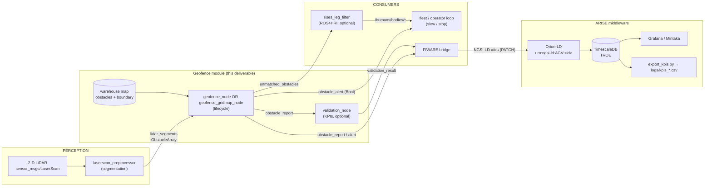

Backends are mutually exclusive (`gridmap_enabled` selects spatial XOR gridmap).
The `validation_node`, `rises_leg_filter`, and the DDS-Enabler path are optional.

## Per-scan detection sequence

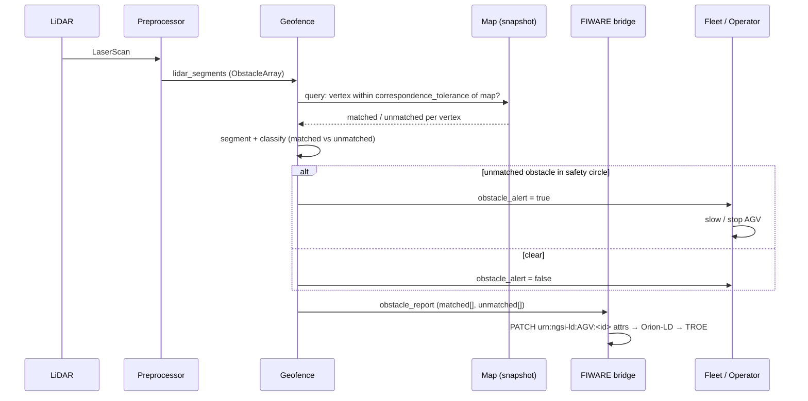

## Operator / AGV-coordination interaction flow

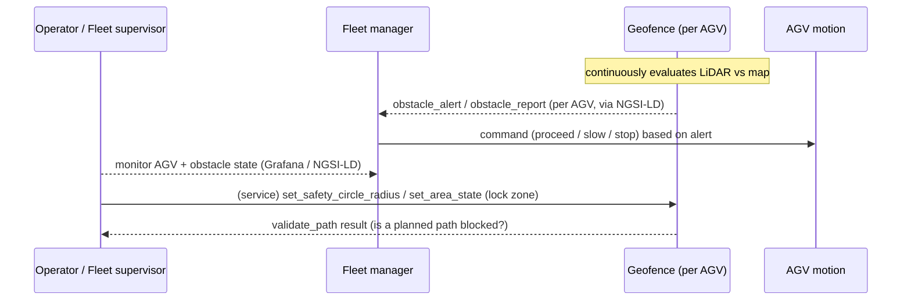

## Intent → mission → task → skill decomposition

Shows how an operator *intent* cascades into a task and its constituent skill calls —
instantiated on the "coordinate AGVs in a shared corridor" example from §1.1 (Table 1),
using the geofence service surface.

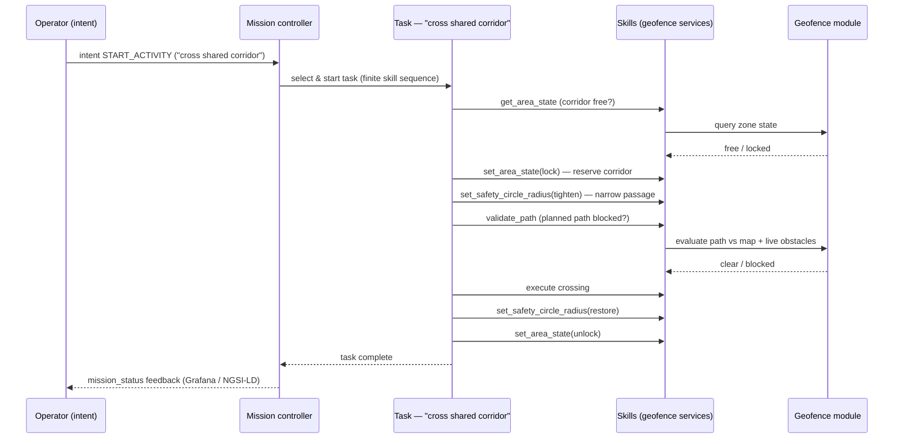

These four views (component, per-scan, operator/coordination, intent→skill decomposition)
are the interaction-flow visuals requested at stage 3; reuse them in the D4 written report.

---

# Module internals & system diagrams

The four diagrams above cover the stage-3 interaction flows. The views below document the rest of the system — node state machines, module internals, fleet aggregation, the FIWARE/NGSI-LD data path, and deployment. Each is generated from and cites the source files in its caption; all render on GitHub.

## State machines

### Geofence Node Lifecycle

Managed-node lifecycle state machine for geofence backends (spatial and gridmap), showing the four primary states (UNCONFIGURED, INACTIVE, ACTIVE, FINALIZED) and transitions via on_configure, on_activate, on_deactivate, on_cleanup. Includes auto-activation timer behavior: when enabled, a 100ms wall timer auto-advances UNCONFIGURED→INACTIVE→ACTIVE, then cancels itself. Source: lifecycle_geofence_node_base.hpp/cpp.

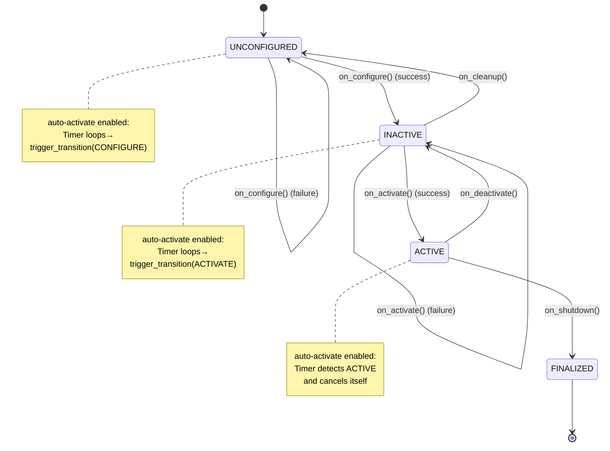

Source: `geofence/common/include/geofence/common/node/lifecycle_geofence_node_base.hpp`, `geofence/common/src/node/lifecycle_geofence_node_base.cpp`

### Mission Controller FSM (ARISE Mission Controller)

Finite state machine for the ARISE mission controller, derived from executeMission() in mission_controller_node.cpp and verified by test cases in test_mission_state_machine.cpp. Shows five operational states (Idle, Active, Succeeded, Failed, Cancelled) and transitions triggered by intents and task execution outcomes.

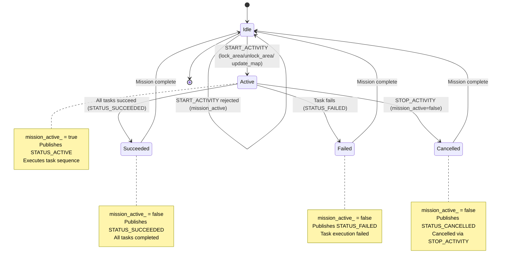

Source: `rises_mission_controller/src/mission_controller_node.cpp`, `rises_mission_controller/include/rises_mission_controller/mission_controller_node.hpp`, `rises_mission_controller/test/test_mission_state_machine.cpp`, `rises_interfaces/msg/MissionStatus.msg`

## Perception & geofence internals

### Multi-LiDAR Synchronization & Segmentation Pipeline

Left-to-right processing pipeline in LaserPreprocessorNode: N synchronized LaserScan inputs flow through TF transformation and PointCloud2 conversion, segmentation strategy selection (DBSCAN/RegionGrow/Distance), spatial indexing with KD-tree, and shape fitting (Point/Line/Circle/Polygon) to produce ObstacleArray. Based on laserscan_preprocessor_node.hpp, laser_synchronizer.hpp, point_cloud_processor.hpp, segmentation_strategy.hpp, spatial_indexer.hpp, and shape_fitter.hpp.

```mermaid
flowchart LR
    A["N LaserScan<br/>Inputs"] -->|topics 0..N-1| B["LaserSynchronizer<br/>ApproximateTime"]
    B -->|onLaserScan| C["PointCloudProcessor<br/>convertToPointCloud2"]
    C -->|TF Transform| D["TF Buffer<br/>target_frame"]
    D -->|cloud_in| E["Point Cloud<br/>Segmentation"]
    E -->|Strategy Select| F["SegmentationStrategy<br/>dbscan/regionGrow/<br/>distanceSegment"]
    F -->|segment_id field| G["SpatialIndexer<br/>KD-tree"]
    G -->|findNeighbors| H["ShapeFitter<br/>Factory"]
    H -->|fitShape| I["Point/Line/Circle<br/>Polygon Fitter"]
    I -->|Obstacle msg| J["ObstacleArray<br/>Publisher"]
    
    style A fill:#e1f5ff
    style B fill:#fff3e0
    style C fill:#fff3e0
    style D fill:#f3e5f5
    style E fill:#f1f8e9
    style F fill:#f1f8e9
    style G fill:#fce4ec
    style H fill:#fff9c4
    style I fill:#fff9c4
    style J fill:#c8e6c9
```

Source: `laserscan_preprocessor/include/laserscan_preprocessor/laserscan_preprocessor_node.hpp`, `laserscan_preprocessor/include/laserscan_preprocessor/sync/laser_synchronizer.hpp`, `laserscan_preprocessor/include/laserscan_preprocessor/processing/point_cloud_processor.hpp`, `laserscan_preprocessor/include/laserscan_preprocessor/segmentation/segmentation_strategy.hpp`, `laserscan_preprocessor/include/laserscan_preprocessor/spatial/spatial_indexer.hpp`, `laserscan_preprocessor/include/laserscan_preprocessor/shapes/shape_fitter.hpp`

### Geofence Backend Abstraction: Spatial vs Gridmap

Class diagram showing the common lifecycle base (LifecycleGeofenceNodeBase) with virtual hooks (matchScan, loadObstaclesFromJson, applyMapUpdates) and two concrete backends: spatial (GeofenceNode + GeofenceMap) and gridmap (GeofenceGridmapNode + GridMap). Ground truth from geofence/common/include/geofence/common/node/lifecycle_geofence_node_base.hpp, geofence/spatial_node/include/geofence/spatial/node/geofencing_node.hpp, geofence/gridmap_node/include/geofence/gridmap/node/geofencing_gridmap_node.hpp, geofence/spatial_node/include/geofence/spatial/map/geofence_map.hpp, geofence/gridmap_node/include/geofence/gridmap/map/gridmap.hpp.

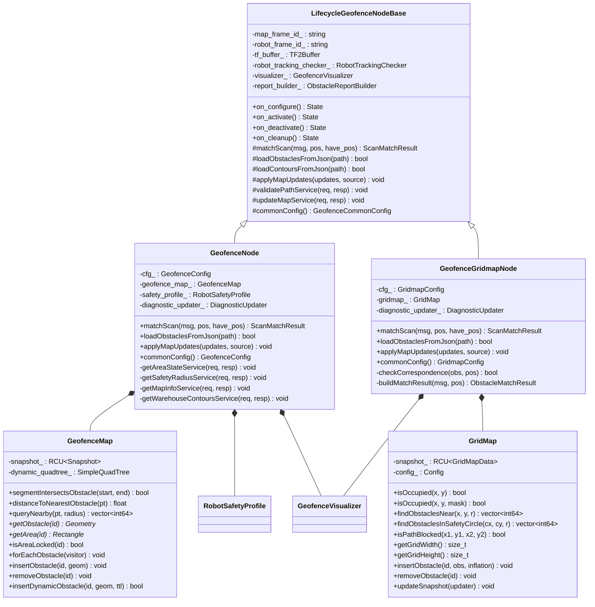

Source: `geofence/common/include/geofence/common/node/lifecycle_geofence_node_base.hpp`, `geofence/spatial_node/include/geofence/spatial/node/geofencing_node.hpp`, `geofence/gridmap_node/include/geofence/gridmap/node/geofencing_gridmap_node.hpp`, `geofence/spatial_node/include/geofence/spatial/map/geofence_map.hpp`, `geofence/gridmap_node/include/geofence/gridmap/map/gridmap.hpp`

## Fleet aggregation & prediction

### Obstacle Heatmap Predictor: Deterministic Pipeline

Data flow from unmatched obstacle reports through track persistence, velocity estimation (least-squares), forward projection (deterministic, non-ML), and Gaussian occupancy grid stamping. Parameters grounded in code: observation_window_sec (default 10.0s), prediction_horizon_sec (30.0s), prediction_step_sec (2.0s), gaussian_sigma (1.0m), grid resolution (0.25m/cell). Source: obstacle_heatmap_predictor/include/obstacle_heatmap_predictor/heatmap_predictor_node.hpp and src/heatmap_predictor_node.cpp.

```mermaid
flowchart LR
    A["obstacle_report<br/>(unmatched_obstacles)"] --> B["obstacleReportCallback"]
    B --> C["updateTrack<br/>per segment ID"]
    C --> D["history buffer<br/>(deque&lt;Observation&gt;)"]
    D --> E["Sliding window trim<br/>(observation_window_sec<br/>default: 10.0s)"]
    E --> F["estimateVelocity<br/>Least-Squares Fit"]
    F --> G["velocity_x, velocity_y<br/>(clamped to 2.0 m/s)"]
    H["evictStaleTracks<br/>(eviction_timeout_sec<br/>default: 5.0s)"] -.-> C
    G --> I["publishHeatmap<br/>(periodic 2 Hz)"]
    I --> J["Take track snapshot<br/>(latest_pos + velocity)"]
    J --> K["For each snapshot:<br/>stamp current position<br/>weight=1.0"]
    K --> L["Project forward<br/>in steps"]
    L --> M["t = 0 to prediction_horizon<br/>(default: 30.0s)<br/>step: prediction_step_sec<br/>(default: 2.0s)"]
    M --> N["Compute predicted_x<br/>predicted_y<br/>via linear extrapolation"]
    N --> O["Confidence decay<br/>1.0 - dt / horizon"]
    O --> P["stampGaussian<br/>on probability_grid"]
    P --> Q["Gaussian kernel<br/>sigma_cells = gaussian_sigma<br/>/ grid_resolution<br/>(default: 1.0m / 0.25m)"]
    Q --> R["3*sigma radius<br/>Gaussian PDF exp"]
    R --> S["Normalize &amp; quantize<br/>to OccupancyGrid<br/>0-100 occupancy"]
    S --> T["publish predicted_occupancy<br/>(nav_msgs/OccupancyGrid)"]
    
    style A fill:#e1f5ff
    style T fill:#c8e6c9
    style F fill:#fff9c4
    style P fill:#ffe0b2
```

Source: `obstacle_heatmap_predictor/include/obstacle_heatmap_predictor/heatmap_predictor_node.hpp`, `obstacle_heatmap_predictor/src/heatmap_predictor_node.cpp`

## Safety & validation

### Safety Node: Diagnostics-Driven Health Monitor & Halt Loop

Closed-loop diagnostics monitoring and path validation in the safety node. Subscribes to /diagnostics (DiagnosticArray) from monitored nodes, tracks per-node health level (OK/WARN/ERROR) and freshness, runs periodic health-check timer, and publishes halt commands on critical failures. Also validates incoming paths against heatmap predictions and geofence service. Source: safety/include/safety/safety.hpp, safety/src/safety.cpp

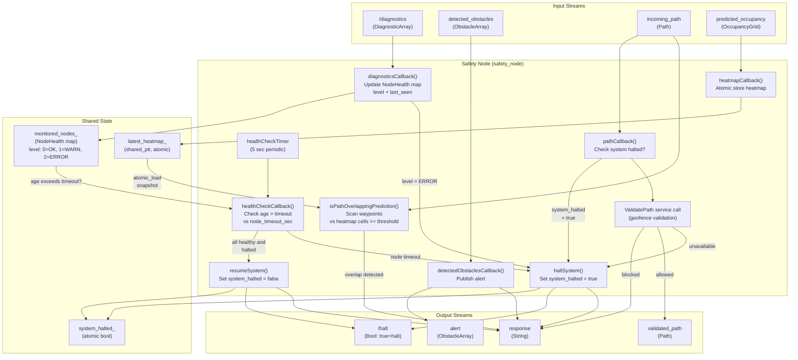

Source: `safety/include/safety/safety.hpp`, `safety/src/safety.cpp`

### Validation Node KPI Measurement Pipeline

Flowchart showing the validation_node's KPI measurement pipeline: JSON ground-truth spawn events are matched against obstacle_report detections using spatial tolerance (2.5m) and time window (3s), robot safety-circle eligibility is tracked via TF, and KPIs (detection latency, ratio, static-structure match rate) are computed and output as JSON validation_result and CSV log. Source files: geofence/validation_node/include/geofence/validation/validation_node.hpp and geofence/validation_node/src/validation_node.cpp

```mermaid
flowchart LR
    subgraph input["Input Sources"]
        spawn["obstacle_spawn<br/>(JSON ground-truth)"]
        report["obstacle_report<br/>(ObstacleReport)"]
        tf["TF Buffer<br/>(robot pose)"]
    end
    
    subgraph register["Obstacle Registration"]
        spawnCB["spawnCallback<br/>Parse JSON<br/>Create SpawnedObstacle"]
        regSpawn["registerSpawnedObstacle<br/>Store w/ metadata<br/>(x, y, r, t_spawn)"]
    end
    
    subgraph match["Detection Matching"]
        reportCB["reportCallback<br/>Extract unmatched_obstacles<br/>per segment"]
        tryMatch["tryMatchDetection<br/>Spatial match: dist &lt; 2.5m<br/>Time gate: 0 &lt; latency &lt; 3s"]
        pending["Buffer as pending<br/>if no spawn found"]
        retroMatch["retroactive match<br/>when spawn arrives"]
    end
    
    subgraph track["Safety Circle Tracking"]
        tfSample["sampleRobotPose<br/>Sample robot pose<br/>via TF every 100ms"]
        circleEntry["recordCircleEntry<br/>Robot dist &lt; eligibility_radius<br/>(3m)"]
        eligible["markEligible<br/>Increment eligible counter"]
    end
    
    subgraph latency["Latency Computation"]
        reportM["reportMatch<br/>Record match event<br/>t_detection, dist_m"]
        finalize["finalizeLatencyIfReady<br/>t_latency = t_detection - t_circle_entry<br/>(signed: before/after entry)"]
        lats["Accumulate:<br/>min, max, sum<br/>latency_samples++"]
    end
    
    subgraph classify["Static Structure Classification"]
        classify_u["classifyAndTrackUnmatched<br/>Read-only classification"]
        intruder["near_spawn?<br/>Legitimate intruder<br/>-&gt; unmatched_intruder_segments"]
        unclaimed["Unclaimed segment<br/>(static miss or noise)"]
        persist["Track persistent IDs<br/>if seen &gt;= persistent_min_reports<br/>(120 scans)<br/>-&gt; static_miss_segments"]
    end
    
    subgraph agg["KPI Aggregation"]
        stats["Compute stats:<br/>Detection Ratio: detected/spawned<br/>Avg Latency: sum/samples<br/>Static Match Rate"]
    end
    
    subgraph output["Output & Logging"]
        json_out["publishResult<br/>JSON validation_result<br/>(std_msgs/String)"]
        csv_out["CSV per-detection log<br/>(if output_file set)"]
    end
    
    spawn --> spawnCB
    spawnCB --> regSpawn
    regSpawn --> retroMatch
    
    report --> reportCB
    reportCB --> tryMatch
    tryMatch -->|match found| reportM
    tryMatch -->|no match| pending
    pending --> retroMatch
    retroMatch --> reportM
    
    tf --> tfSample
    tfSample --> circleEntry
    circleEntry --> eligible
    
    reportM --> finalize
    finalize --> lats
    
    reportCB --> classify_u
    classify_u -->|dist &lt; 2.5m| intruder
    classify_u -->|dist &gt;= 2.5m| unclaimed
    unclaimed --> persist
    
    intruder --> stats
    persist --> stats
    lats --> stats
    
    stats --> json_out
    stats --> csv_out
    
    json_out --> output
    csv_out --> output
```

Source: `geofence/validation_node/include/geofence/validation/validation_node.hpp`, `geofence/validation_node/src/validation_node.cpp`, `rises_interfaces/msg/geofencing/ObstacleReport.msg`

## Middleware & deployment

### FIWARE Data Path: ROS 2 → DDS Enabler → Orion-LD → TimescaleDB → Grafana

End-to-end telemetry pipeline showing ROS 2 core nodes publishing domain-specific messages, the fiware_bridge_node serializing to JSON strings on fiware/* topics, the DDS Enabler bridging to Orion-LD NGSI-LD entities, dual storage (MongoDB for state, TimescaleDB for temporal data), and visualization layers. The architecture uses automatic DDS type discovery (Fast-DDS 3.x) and ignores complex message types in favor of std_msgs/String JSON payloads. Grounded in actual topic names, entity IDs, and service calls from fiware_bridge_node.cpp, dds-enabler.json, docker-compose.yaml, and Dockerfile sources.

```mermaid
flowchart LR
    subgraph ROS2["ROS 2 Core Nodes<br/>(Warehouse AGV Domain)"]
        ObstacleReport["obstacle_report<br/>(ObstacleReport)"]
        ObstacleAlert["obstacle_alert<br/>(Bool)"]
        GeofenceReady["geofence_ready<br/>(Bool)"]
        WarehouseContours["warehouse_contours<br/>(Contours)"]
        Odometry["odometry/filtered<br/>(Odometry)"]
        Diagnostics["/diagnostics<br/>(DiagnosticArray)"]
        PredictedOccupancy["predicted_occupancy<br/>(OccupancyGrid)"]
    end

    Bridge["fiware_bridge_node<br/>(C++ ROS 2 node)<br/>JSON serialization"]

    subgraph FIWARE["FIWARE Topics (DDS)"]
        ObstacleSummary["fiware/obstacle_summary<br/>(String JSON)"]
        AlertJSON["fiware/obstacle_alert<br/>(String JSON)"]
        ReadyJSON["fiware/geofence_ready<br/>(String JSON)"]
        GeometryJSON["fiware/warehouse_geometry<br/>(String JSON)"]
        PositionJSON["fiware/robot_position<br/>(String JSON)"]
        HealthJSON["fiware/system_health<br/>(String JSON)"]
        HeatmapJSON["fiware/heatmap_summary<br/>(String JSON)"]
        MapObstacles["fiware/map_obstacles<br/>(String JSON)"]
        ObstacleSegments["fiware/obstacle_segments<br/>(String JSON)"]
        ValidationResult["fiware/validation_result<br/>(String JSON)"]
    end

    DDSEnabler["DDS Enabler<br/>(eProsima Vulcanexus)<br/>Fast-DDS 3.x type discovery<br/>rt/agv_0/fiware/* → NGSI-LD"]

    subgraph Orion["Orion-LD Context Broker<br/>(NGSI-LD Entity: agv_0)"]
        EntityAttrs["urn:ngsi-ld:AGV:agv_0<br/>attributes:<br/>obstacle_summary<br/>obstacle_alert<br/>geofence_ready<br/>warehouse_geometry<br/>robot_position<br/>system_health<br/>heatmap_summary<br/>map_obstacles<br/>obstacle_segments<br/>validation_result"]
    end

    Mongo["MongoDB<br/>(Current State)<br/>Port 27017"]
    TimeScale["TimescaleDB<br/>(TROE Temporal)<br/>Port 5432"]

    subgraph Viz["Visualization & Queries"]
        Grafana["Grafana<br/>Port 3000<br/>Dashboards"]
        Mintaka["Mintaka<br/>Port 8080<br/>Temporal REST API"]
    end

    ROS2 -->|subscribe and transform| Bridge
    Bridge -->|publish JSON| FIWARE
    FIWARE -->|DDS topic discovery<br/>and NGSI-LD PATCH| DDSEnabler
    DDSEnabler -->|REST PATCH<br/>to entity| Orion
    Orion -->|UPSERT state| Mongo
    Orion -->|TROE append| TimeScale
    Grafana -->|REST query<br/>entity attributes| Orion
    Grafana -->|SQL query<br/>historical data| TimeScale
    Mintaka -->|SQL query<br/>temporal RDF| TimeScale
```

Source: `fiware_bridge/src/fiware_bridge_node.cpp`, `fiware/docker-compose.yaml`, `fiware/dds-enabler/Dockerfile`, `fiware/config/dds-enabler.json`

### NGSI-LD AGV Entity Model

NGSI-LD AGV entity (urn:ngsi-ld:AGV:agv_0) and its attributes as mapped from ROS 2 messages by fiware_bridge. Attributes include obstacle summary, position, health, geofence status, geometry, heatmap, and map obstacles, extracted from JSON-formatted fiware/* topics.

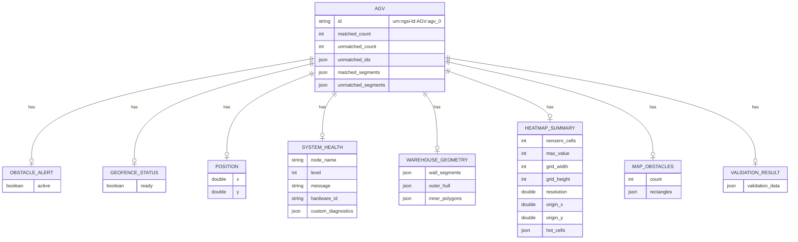

Source: `fiware_bridge/include/fiware_bridge/fiware_bridge_node.hpp`, `fiware_bridge/src/fiware_bridge_node.cpp`

### ARISE/RISES Deployment Topology

Multi-container deployment topology showing scenario selection, AGV_DEPLOY_MODE routing, and integration between ROS 2 geofence stack, ARISE middleware, and FIWARE monitoring stack. Grounded in rises.dockerfile (skill bridge, mission controller, heatmap, fiware_bridge), central.dockerfile (translator), docker-compose.yaml (Orion-LD, MongoDB, TimescaleDB, Grafana, DDS Enabler), and entrypoint.sh routing logic.

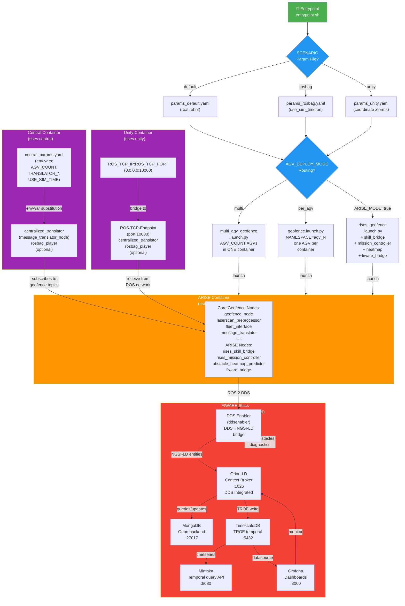

Source: `entrypoint.sh`, `rises.dockerfile`, `central.dockerfile`, `central_entrypoint.sh`, `unity_entrypoint.sh`, `fiware/docker-compose.yaml`
